# 🎓 Exam Proctoring System

A full-stack web application built with **Python Flask** and **SQLite** for creating, managing, and taking online quizzes and exams. The system includes secure user authentication, an admin dashboard, PDF question upload, AI-assisted question generation, and result tracking.

---

## ✨ Features

- 🔐 User Registration & Login
- 👨‍💼 Admin Dashboard
- 📝 Create and Manage Quizzes
- ➕ Add Questions to Quizzes
- 📄 Upload Questions from PDF
- 🤖 AI-Assisted Question Generation (Gemini API)
- ⏱ Quiz Timer
- 📊 Score Calculation and Results
- 🏆 Leaderboard
- 📱 Responsive User Interface

---

## 🛠 Technologies Used

- Python
- Flask
- SQLite
- HTML5
- CSS3
- JavaScript
- Google Gemini API

---

## 📁 Project Structure

```
exam-proctoring-system/
│
├── app.py
├── db.py
├── init_db.py
├── templates/
├── static/
├── README.md
└── requirements.txt
```

---

## 🚀 Installation

1. Clone the repository

```bash
git clone https://github.com/albinbince10-create/exam-proctoring-system.git
```

2. Navigate to the project

```bash
cd exam-proctoring-system
```

3. Install dependencies

```bash
pip install -r requirements.txt
```

4. Create a `.env` file

```env
GEMINI_API_KEY=YOUR_API_KEY
```

5. Initialize the database

```bash
python init_db.py
```

6. Run the application

```bash
python app.py
```

---

## 📸 Screenshots

Add screenshots here later.

Example:

- Home Page
- Login Page
- Admin Dashboard
- Quiz Page
- Results Page

---

## 🔮 Future Improvements

- Webcam-based AI Proctoring
- Face Recognition
- Email Notifications
- Dark Mode
- Analytics Dashboard
- Certificate Generation

---
## 📸 Screenshots

### 🏠 Home Page
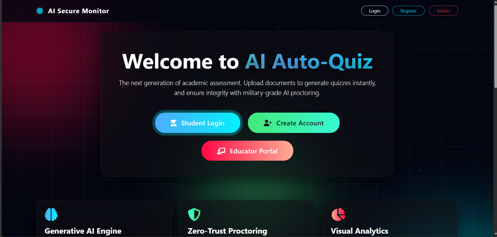

### 🔐 Admin Login
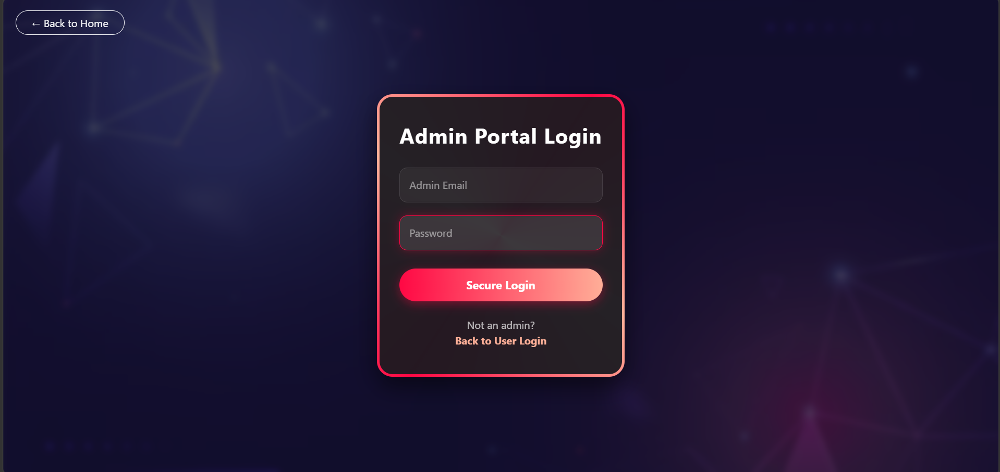

### 👤 User Login
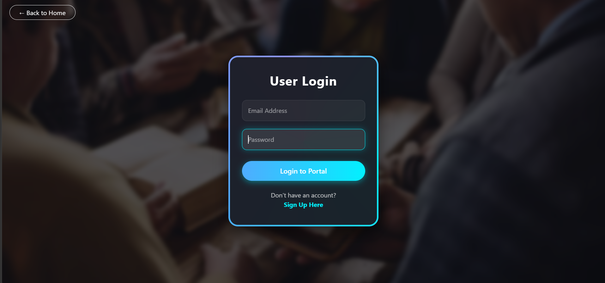

### 📝 User Registration
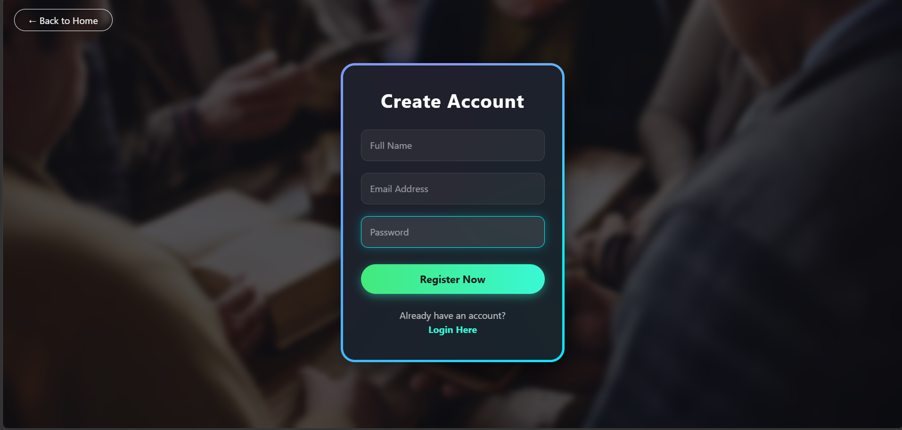

### 📚 User Dashboard
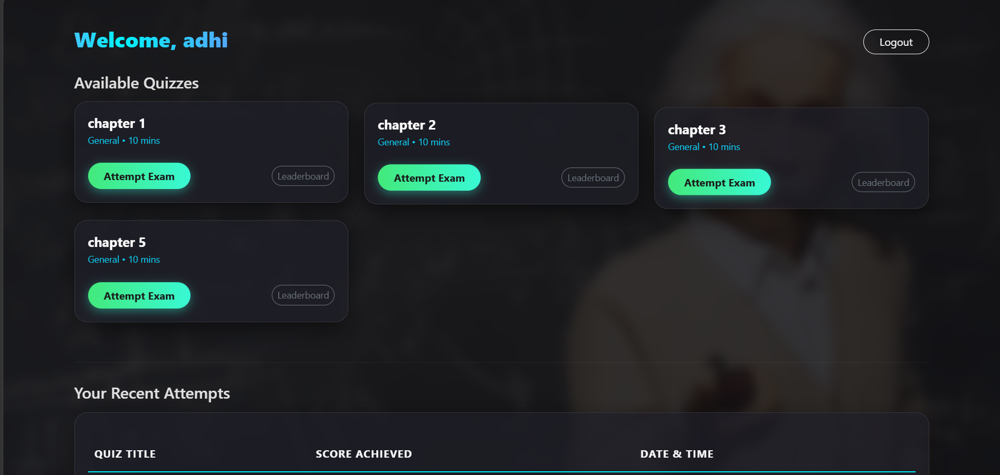

### 📋 Manage Exams
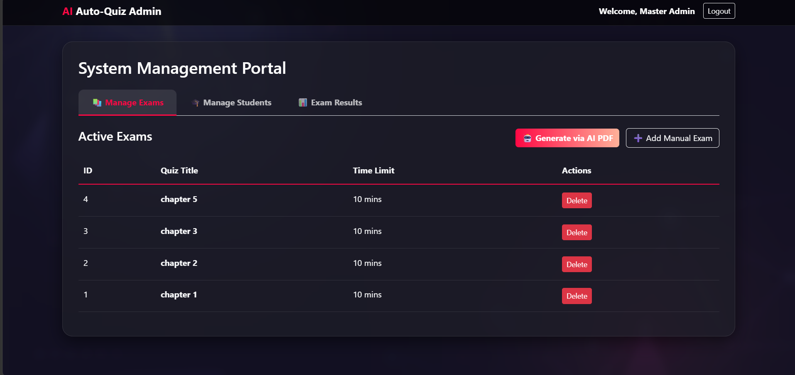

### ✏️ Exam Edit Page
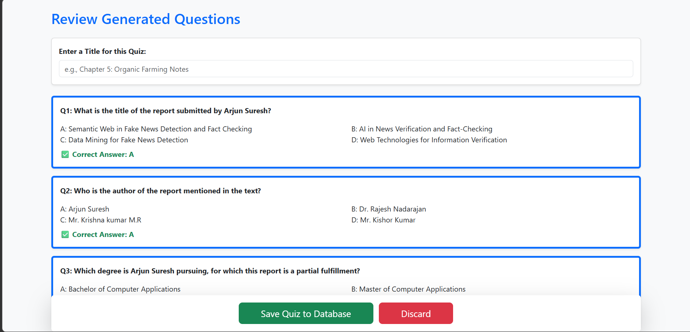

### 👨‍🎓 Manage Students
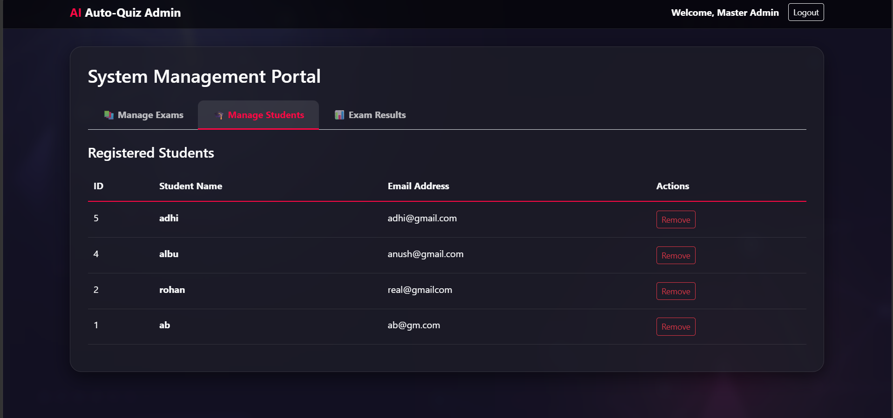

### 🤖 AI Quiz Generation
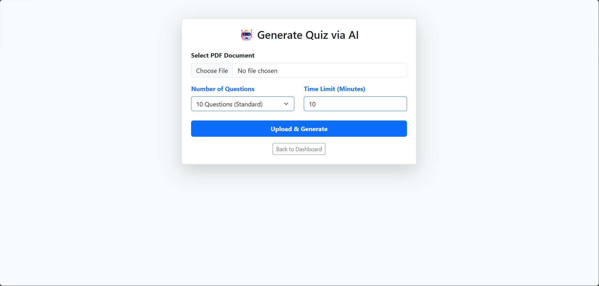

### ➕ Manual Question Adding
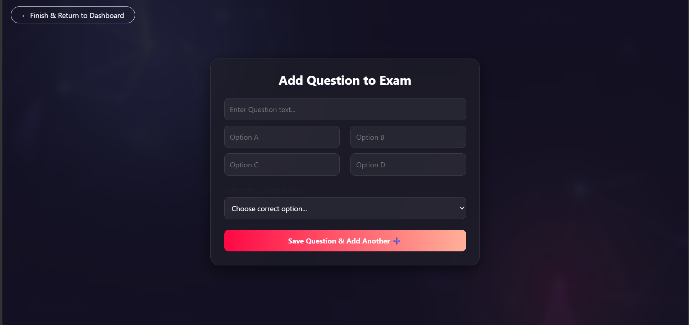

### 🧪 Exam Page
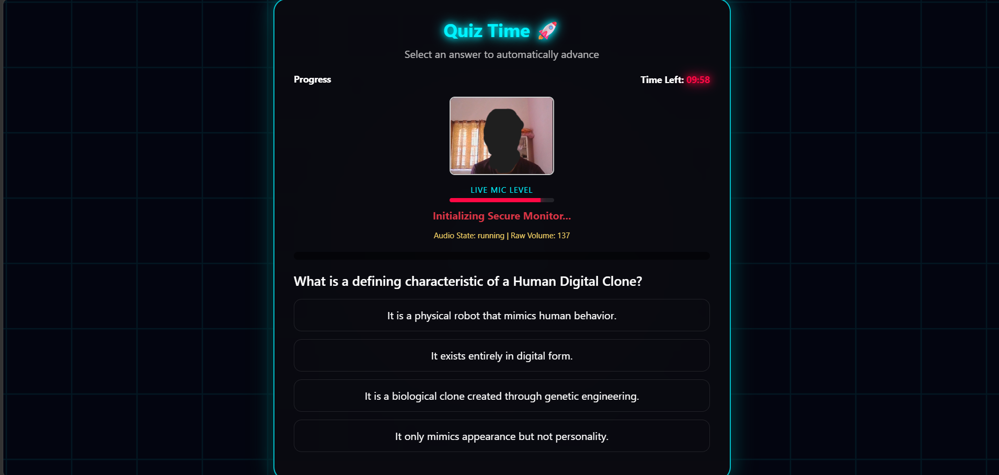

### 📄 Blank Exam
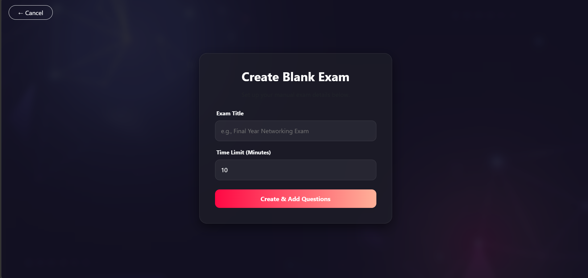

### 📊 Score
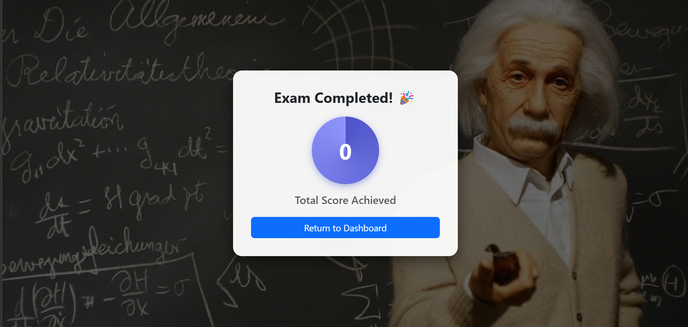

### 📈 Results & Analytics
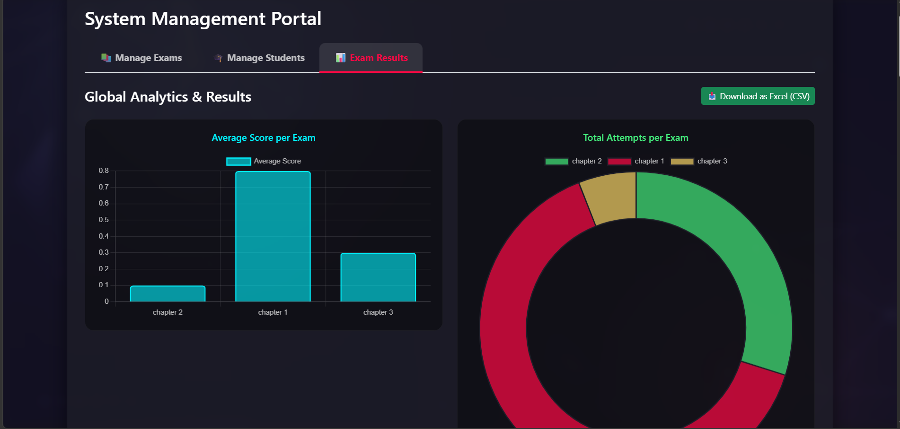

### 🏆 User Ranking
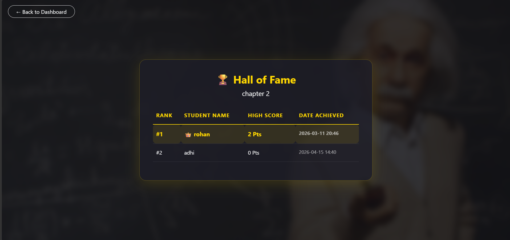

### 📜 User History
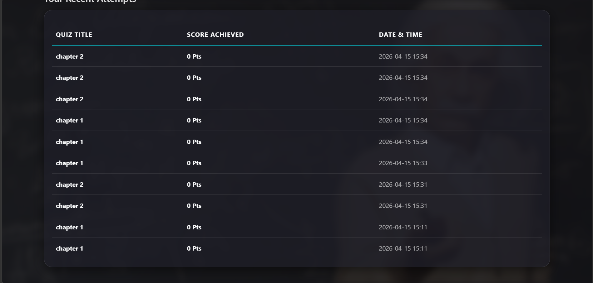

## 👨‍💻 Developer

**Albin Bince**

GitHub: https://github.com/albinbince10-create

---

## 📄 License

This project is developed for educational and learning purposes.